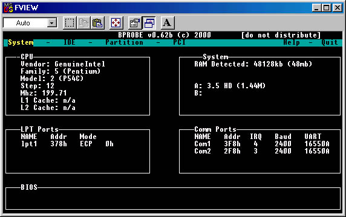
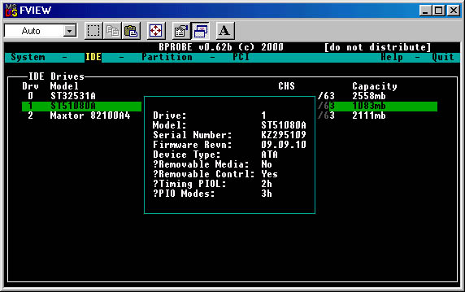
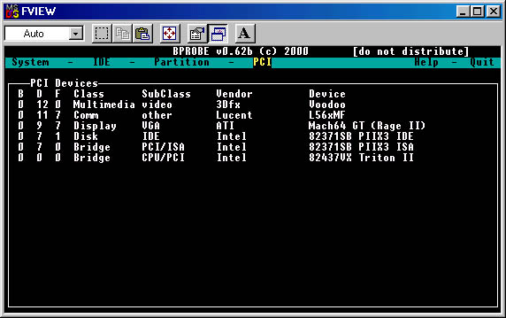

**Bprobe**

A DOS base tool that detects and displays information about a PC.

Written in 2000 after I started working an IT job. 

I became interested in how PC hardware worked at a low level and
began studying the Linux kernel. I used what I learned to write a number of classes that scanned for and worked with
hardware devices. Eventually my library of code grew large enough that I was able to cobble together a program with
a menu system.

After developing and testing for about a year, Bprobe was packaged into a commercial utility and sold through several
 software vendors. About 3000 copies were sold and 700+ users registered for our web site to receive updates.

This code was one of my first large projects and is a bit of a mess, but it worked well on PC's from it's era. 

**Screenshots**

